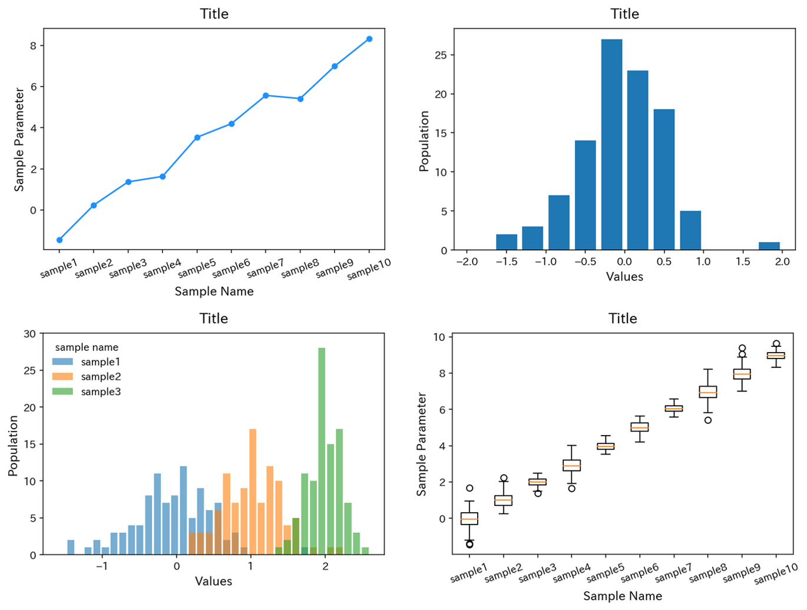

# Pythonを用いたデータ解析・プロットのサンプル
Python(numpy,matplotlib,pandas)を使ったデータ解析のサンプルが入ったノートブック(AnalyzeSample.ipynb)です。
下のようなプロットが誰でも描けるようになります。
## ファイルの説明
* 解析用のJupyterノートブック(AnalyzeSample.ipynb)
* サンプルデータセット(sample_dataset.csv)
## 環境構築方法
~~ggrks~~
https://ai-inter1.com/python-install/ (Python環境構築)
https://ai-inter1.com/jupyter-notebook/ (Jupyter-notebookの使い方)
このあたりを参考にしてみてください。

