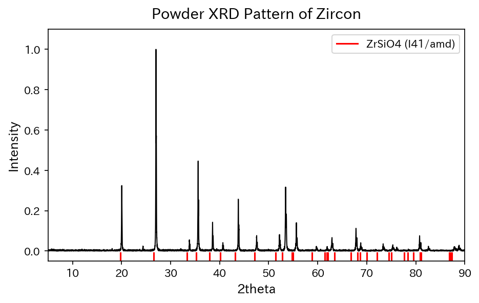

# Pythonを用いたデータ解析・プロットのサンプル
Python(numpy,matplotlib,pandas)を使ったデータ解析のサンプルが入ったノートブック(AnalyzeSample.ipynb)です。  
下のようなプロットが誰でも描けるようになります。
## ファイルの説明
* 解析用のJupyterノートブック(AnalyzeSample.ipynb)
* XRDスペクトル解析のサンプル(SpectrumPlotSample.ipynb)
* サンプルデータセット(sample_dataset.csv)
* ジルコンの粉末XRDデータ(Zircon__R050034-1__Powder__Xray_Data_XY_Processed__4054.txt)
* ジルコンの理論的回折ピークのデータ(mp-4820_xrd_Cu.json)
## 環境構築方法
~~ggrks~~   
* https://ai-inter1.com/python-install/ (Python環境構築)   
* https://ai-inter1.com/jupyter-notebook/ (Jupyter-notebookの使い方)
## サンプル画像(AnalyzeSample.ipynb)

## サンプル画像(SpectrumPlotSample.ipynb)

